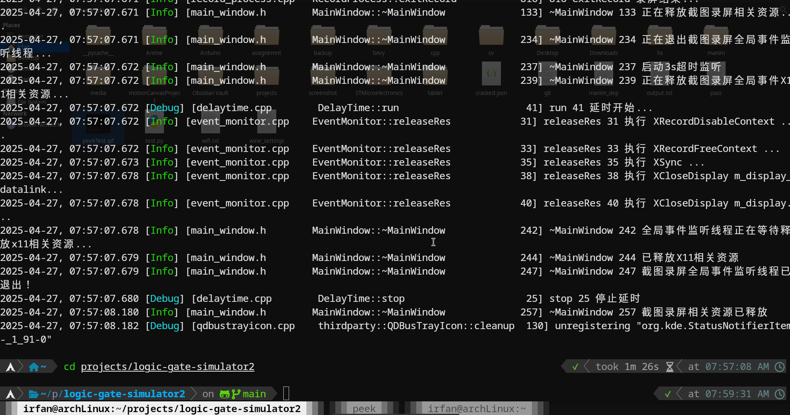
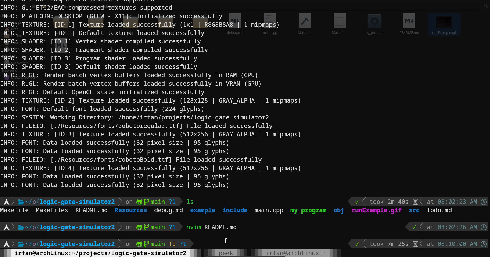

# logic-gate-simulator2

This is a basic logic gate simulator,Created with raylib and c++.

### Installation
For this you ned to install raylib,C library,Version 5.5.
[raylib webiste](https://www.raylib.com/)

Go inside the root directory
Then 
```bash
make clean
make 
```
The program will be my_program
### Example


